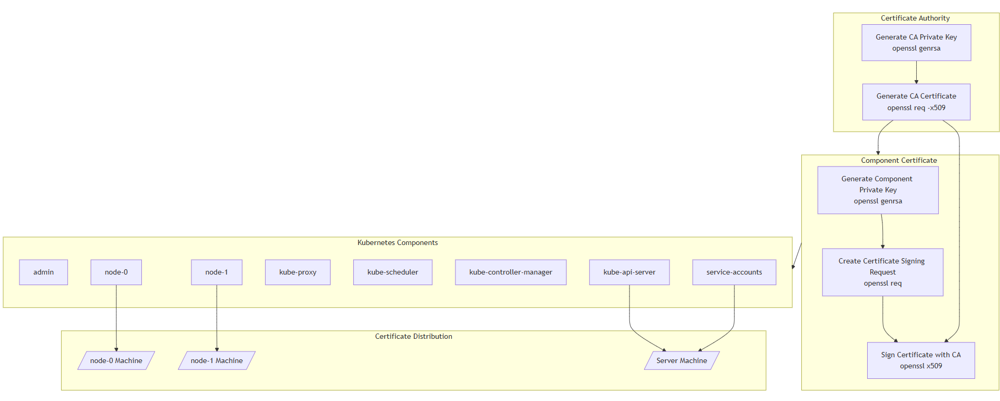

# Provisioning a CA and Generating TLS Certificates

In this lab you will provision a [PKI Infrastructure](https://en.wikipedia.org/wiki/Public_key_infrastructure) using openssl to bootstrap a Certificate Authority, and generate TLS certificates for the following components: kube-apiserver, kube-controller-manager, kube-scheduler, kubelet, and kube-proxy. The commands in this section should be run from the `jumpbox`.

## Certificate Authority

In this section you will provision a Certificate Authority that can be used to generate additional TLS certificates for the other Kubernetes components. Setting up CA and generating certificates using `openssl` can be time-consuming, especially when doing it for the first time. To streamline this lab, I've included an openssl configuration file `ca.conf`, which defines all the details needed to generate certificates for each Kubernetes component. 



Take a moment to review the `ca.conf` configuration file:

```bash
cat ca.conf
```

You don't need to understand everything in the `ca.conf` file to complete this tutorial, but you should consider it a starting point for learning `openssl` and the configuration that goes into managing certificates at a high level.

Every certificate authority starts with a private key and root certificate. In this section we are going to create a self-signed certificate authority, and while that's all we need for this tutorial, this shouldn't be considered something you would do in a real-world production environment.

Generate the CA configuration file, certificate, and private key:

```bash
{
  openssl genrsa -out ca.key 4096
  openssl req -x509 -new -sha512 -noenc \
    -key ca.key -days 3653 \
    -config ca.conf \
    -out ca.crt
}
```

Results:

```txt
ca.crt ca.key
```

## Create Client and Server Certificates

In this section you will generate client and server certificates for each Kubernetes component and a client certificate for the Kubernetes `admin` user.

Generate the certificates and private keys:

```bash
certs=(
  "admin" "node-0" "node-1"
  "kube-proxy" "kube-scheduler"
  "kube-controller-manager"
  "kube-api-server"
  "service-accounts"
)
```

```bash
for i in ${certs[*]}; do
  openssl genrsa -out "${i}.key" 4096

  openssl req -new -key "${i}.key" -sha256 \
    -config "ca.conf" -section ${i} \
    -out "${i}.csr"
  
  openssl x509 -req -days 3653 -in "${i}.csr" \
    -copy_extensions copyall \
    -sha256 -CA "ca.crt" \
    -CAkey "ca.key" \
    -CAcreateserial \
    -out "${i}.crt"
done
```

The results of running the above command will generate a private key, certificate request, and signed SSL certificate for each of the Kubernetes components. You can list the generated files with the following command:

```bash
ls -1 *.crt *.key *.csr
```

## Distribute the Client and Server Certificates

In this section you will copy the various certificates to every machine at a path where each Kubernetes component will search for its certificate pair. In a real-world environment these certificates should be treated like a set of sensitive secrets as they are used as credentials by the Kubernetes components to authenticate to each other.

Copy the appropriate certificates and private keys to the `node-0` and `node-1` machines:

```bash
for host in node-0 node-1; do
  ssh root@$host mkdir /var/lib/kubelet/
  
  scp ca.crt root@$host:/var/lib/kubelet/
    
  scp $host.crt \
    root@$host:/var/lib/kubelet/kubelet.crt
    
  scp $host.key \
    root@$host:/var/lib/kubelet/kubelet.key
done
```

Copy the appropriate certificates and private keys to the `server` machine:

```bash
scp \
  ca.key ca.crt \
  kube-api-server.key kube-api-server.crt \
  service-accounts.key service-accounts.crt \
  root@server:~/
```

> The `kube-proxy`, `kube-controller-manager`, `kube-scheduler`, and `kubelet` client certificates will be used to generate client authentication configuration files in the next lab.

Next: [Generating Kubernetes Configuration Files for Authentication](05-kubernetes-configuration-files.md)
