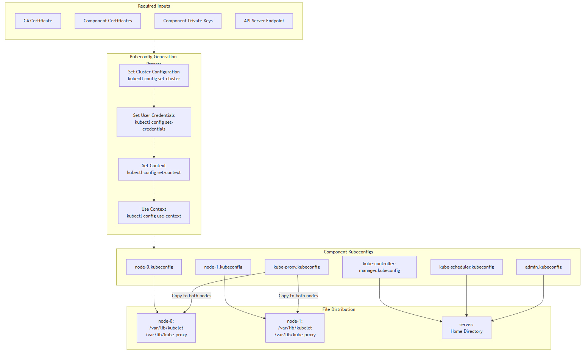

# Generating Kubernetes Configuration Files for Authentication

In this lab you will generate [Kubernetes client configuration files](https://kubernetes.io/docs/concepts/configuration/organize-cluster-access-kubeconfig/), typically called kubeconfigs, which configure Kubernetes clients to connect and authenticate to Kubernetes API Servers.

## Client Authentication Configs

In this section you will generate kubeconfig files for the `kubelet` and the `admin` user.



### The kubelet Kubernetes Configuration File

When generating kubeconfig files for Kubelets the client certificate matching the Kubelet's node name must be used. This will ensure Kubelets are properly authorized by the Kubernetes [Node Authorizer](https://kubernetes.io/docs/admin/authorization/node/).

> The following commands must be run in the same directory used to generate the SSL certificates during the [Generating TLS Certificates](04-certificate-authority.md) lab.

Generate a kubeconfig file for the node-0 worker node:

```bash
for host in node-0 node-1; do
  kubectl config set-cluster kubernetes-the-hard-way \
    --certificate-authority=ca.crt \
    --embed-certs=true \
    --server=https://server.kubernetes.local:6443 \
    --kubeconfig=${host}.kubeconfig

  kubectl config set-credentials system:node:${host} \
    --client-certificate=${host}.crt \
    --client-key=${host}.key \
    --embed-certs=true \
    --kubeconfig=${host}.kubeconfig

  kubectl config set-context default \
    --cluster=kubernetes-the-hard-way \
    --user=system:node:${host} \
    --kubeconfig=${host}.kubeconfig

  kubectl config use-context default \
    --kubeconfig=${host}.kubeconfig
done
```

Results:

```text
node-0.kubeconfig
node-1.kubeconfig
```

### The kube-proxy Kubernetes Configuration File

Generate a kubeconfig file for the `kube-proxy` service:

```bash
{
  kubectl config set-cluster kubernetes-the-hard-way \
    --certificate-authority=ca.crt \
    --embed-certs=true \
    --server=https://server.kubernetes.local:6443 \
    --kubeconfig=kube-proxy.kubeconfig

  kubectl config set-credentials system:kube-proxy \
    --client-certificate=kube-proxy.crt \
    --client-key=kube-proxy.key \
    --embed-certs=true \
    --kubeconfig=kube-proxy.kubeconfig

  kubectl config set-context default \
    --cluster=kubernetes-the-hard-way \
    --user=system:kube-proxy \
    --kubeconfig=kube-proxy.kubeconfig

  kubectl config use-context default \
    --kubeconfig=kube-proxy.kubeconfig
}
```

Results:

```text
kube-proxy.kubeconfig
```

### The kube-controller-manager Kubernetes Configuration File

Generate a kubeconfig file for the `kube-controller-manager` service:

```bash
{
  kubectl config set-cluster kubernetes-the-hard-way \
    --certificate-authority=ca.crt \
    --embed-certs=true \
    --server=https://server.kubernetes.local:6443 \
    --kubeconfig=kube-controller-manager.kubeconfig

  kubectl config set-credentials system:kube-controller-manager \
    --client-certificate=kube-controller-manager.crt \
    --client-key=kube-controller-manager.key \
    --embed-certs=true \
    --kubeconfig=kube-controller-manager.kubeconfig

  kubectl config set-context default \
    --cluster=kubernetes-the-hard-way \
    --user=system:kube-controller-manager \
    --kubeconfig=kube-controller-manager.kubeconfig

  kubectl config use-context default \
    --kubeconfig=kube-controller-manager.kubeconfig
}
```

Results:

```text
kube-controller-manager.kubeconfig
```


### The kube-scheduler Kubernetes Configuration File

Generate a kubeconfig file for the `kube-scheduler` service:

```bash
{
  kubectl config set-cluster kubernetes-the-hard-way \
    --certificate-authority=ca.crt \
    --embed-certs=true \
    --server=https://server.kubernetes.local:6443 \
    --kubeconfig=kube-scheduler.kubeconfig

  kubectl config set-credentials system:kube-scheduler \
    --client-certificate=kube-scheduler.crt \
    --client-key=kube-scheduler.key \
    --embed-certs=true \
    --kubeconfig=kube-scheduler.kubeconfig

  kubectl config set-context default \
    --cluster=kubernetes-the-hard-way \
    --user=system:kube-scheduler \
    --kubeconfig=kube-scheduler.kubeconfig

  kubectl config use-context default \
    --kubeconfig=kube-scheduler.kubeconfig
}
```

Results:

```text
kube-scheduler.kubeconfig
```

### The admin Kubernetes Configuration File

Generate a kubeconfig file for the `admin` user:

```bash
{
  kubectl config set-cluster kubernetes-the-hard-way \
    --certificate-authority=ca.crt \
    --embed-certs=true \
    --server=https://127.0.0.1:6443 \
    --kubeconfig=admin.kubeconfig

  kubectl config set-credentials admin \
    --client-certificate=admin.crt \
    --client-key=admin.key \
    --embed-certs=true \
    --kubeconfig=admin.kubeconfig

  kubectl config set-context default \
    --cluster=kubernetes-the-hard-way \
    --user=admin \
    --kubeconfig=admin.kubeconfig

  kubectl config use-context default \
    --kubeconfig=admin.kubeconfig
}
```

Results:

```text
admin.kubeconfig
```

## Distribute the Kubernetes Configuration Files

Copy the `kubelet` and `kube-proxy` kubeconfig files to the node-0 instance:

```bash
for host in node-0 node-1; do
  ssh root@$host "mkdir /var/lib/{kube-proxy,kubelet}"
  
  scp kube-proxy.kubeconfig \
    root@$host:/var/lib/kube-proxy/kubeconfig \
  
  scp ${host}.kubeconfig \
    root@$host:/var/lib/kubelet/kubeconfig
done
```

Copy the `kube-controller-manager` and `kube-scheduler` kubeconfig files to the controller instance:

```bash
scp admin.kubeconfig \
  kube-controller-manager.kubeconfig \
  kube-scheduler.kubeconfig \
  root@server:~/
```

Next: [Generating the Data Encryption Config and Key](06-data-encryption-keys.md)
